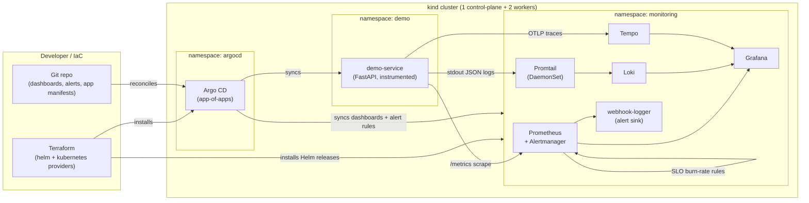
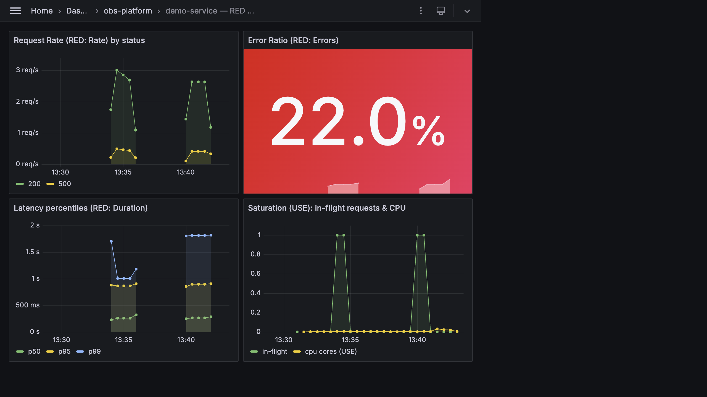
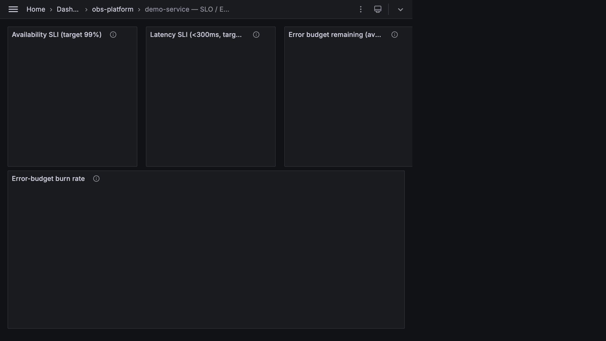
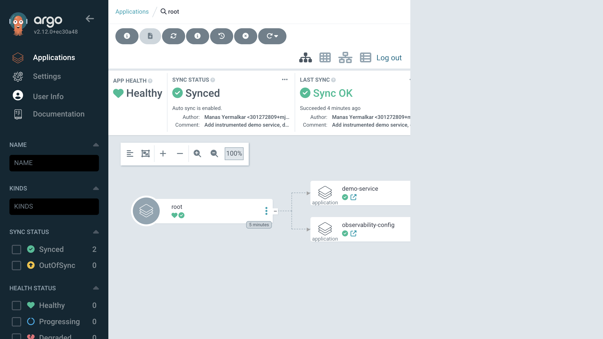
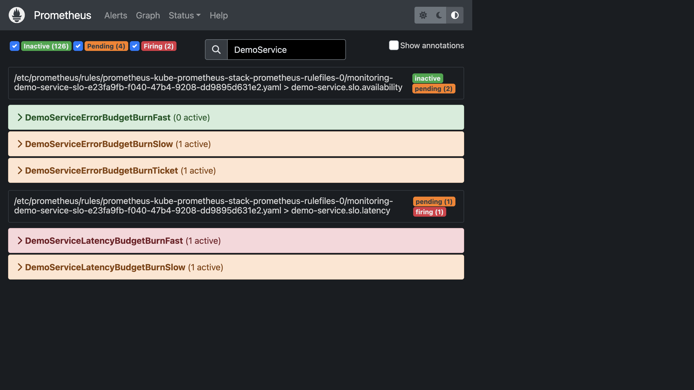

# k8s-observability-platform

> A fully reproducible, **one-command** observability platform for Kubernetes —
> provisioned with **Terraform**, deployed via **GitOps (Argo CD)**, running
> 100% locally on **kind** (zero cloud cost), and shipping an instrumented demo
> microservice so the dashboards, SLOs, and alerts have **real data**.


`make up` → a 3-node Kubernetes cluster running Prometheus, Grafana, Loki,
Tempo, and Alertmanager, with dashboards-as-code, SLO burn-rate alerting, and an
app-of-apps GitOps workflow. `make demo-load` generates traffic until the SLO
alerts fire.

---

## Architecture



**Data flow:** the demo app emits the three pillars — **metrics** (scraped by
Prometheus), **logs** (tailed by Promtail → Loki), **traces** (pushed via OTLP →
Tempo). Grafana unifies all three with datasources-as-code, including
log→trace→metric correlation. Prometheus evaluates SLO burn-rate rules and
routes alerts through Alertmanager to a webhook receiver.

---

## Tool versions

Everything runs on **macOS (Apple Silicon)** with Docker Desktop. Pinned for
reproducibility — bump deliberately.

| Tool                    | Version (tested)   | Notes                                    |
| ----------------------- | ------------------ | ---------------------------------------- |
| Docker Desktop          | ≥ 4.30 (engine 26) | Allocate ≥ 6 GB RAM, ≥ 4 CPU             |
| kind                    | ≥ 0.23.0           | Kubernetes-in-Docker                     |
| Kubernetes (node image) | v1.30.0            | `kindest/node:v1.30.0`                   |
| kubectl                 | ≥ 1.30             |                                          |
| helm                    | ≥ 3.15             | Used by the Terraform helm provider      |
| terraform               | ≥ 1.9.0            | helm `~> 2.14`, kubernetes `~> 2.31`     |
| kustomize               | ≥ 5.4              | Needed for `--load-restrictor` builds    |
| kubeconform *(optional)*| ≥ 0.6.7            | `make lint-k8s`                          |
| tflint *(optional)*     | ≥ 0.52             | `make lint-tf`                           |

**Pinned chart versions** (in `terraform/variables.tf`):
kube-prometheus-stack `61.9.0`, loki-stack `2.10.2`, tempo `1.10.3`,
argo-cd `7.4.1`.

Install prereqs on macOS:

```bash
brew install kind kubectl helm terraform kustomize kubeconform tflint
# + Docker Desktop (running)
```

---

## Quickstart

```bash
# 1. Bring everything up (cluster + platform + demo app).  ~5–8 min first run.
make up

# 2. Generate traffic so metrics/logs/traces flow and SLO alerts eventually fire.
make demo-load          # runs ~5 min; Ctrl-C to stop

# 3. Open the UIs (ports are mapped from kind to localhost):
make info               # prints URLs + credentials
```

| UI            | URL                       | Credentials                          |
| ------------- | ------------------------- | ------------------------------------ |
| Grafana       | http://localhost:30300    | `admin` / `prom-operator`            |
| Argo CD       | http://localhost:30080    | `admin` / `make argocd-password`     |
| Prometheus    | http://localhost:30900    | —                                    |
| Alertmanager  | http://localhost:30093    | —                                    |

In Grafana, open the **obs-platform** folder → *demo-service — RED / USE* and
*demo-service — SLO / Error Budget* dashboards.

Tear it all down:

```bash
make down
```

### Enabling the GitOps flow (optional but recommended for the full story)

`make up` seeds the demo app + config directly for an instant local experience.
To hand ongoing reconciliation to Argo CD from **your** Git repo:

```bash
make set-owner GH_USER=<mjy-26>   # rewrites the mjy-26 placeholder
git init && git add -A && git commit -m "init" 
git remote add origin git@github.com:<mjy-26>/k8s-observability-platform.git
git push -u origin main
make argocd-bootstrap                    # applies the app-of-apps root
```

Argo CD now watches the repo: edit a dashboard JSON or an alert threshold, push,
and it reconciles automatically. Watch it in the Argo CD UI.

### Make targets

| Target                | Description                                             |
| --------------------- | ------------------------------------------------------- |
| `make up`             | Full bootstrap: cluster + platform + demo app           |
| `make down`           | Destroy the stack and delete the kind cluster           |
| `make demo-load`      | Generate traffic (drives dashboards + SLO alerts)       |
| `make dashboards`     | Re-apply Grafana dashboards-as-code                     |
| `make test`           | Smoke test: assert all platform pods become Ready       |
| `make lint`           | Terraform fmt/validate/tflint + kubeconform manifests   |
| `make info`           | Print URLs and credentials                              |
| `make argocd-bootstrap` | Apply the app-of-apps root (GitOps)                   |
| `make set-owner`      | Rewrite the `mjy-26` placeholder repo-wide       |

---

## Repository structure

```
k8s-observability-platform/
├── kind/kind-cluster.yaml         # 3-node cluster + host port mappings
├── terraform/                     # PLATFORM layer (helm + kubernetes providers)
│   ├── *.tf                       # namespaces, kps, loki, tempo, argocd
│   └── values/                    # Helm values incl. Grafana datasources-as-code
├── app/                           # instrumented FastAPI demo microservice
│   ├── main.py  requirements.txt  Dockerfile
├── k8s/
│   ├── demo-app/                  # kustomize manifests for the demo service
│   ├── config/                    # dashboards (ConfigMaps) + alerts + alert sink
│   └── argocd/
│       ├── root-app.yaml          # app-of-apps ROOT
│       ├── apps/                  # child Applications (demo app + config)  ← GitOps
│       └── platform/              # OPTIONAL: stack-as-Argo-CD-Apps (see its README)
├── dashboards/                    # Grafana dashboards as JSON (source of truth)
├── alerts/slo-burn-rate.yaml      # SLO multi-window burn-rate PrometheusRule
├── scripts/                       # load generator + smoke test
├── .github/workflows/ci.yaml      # lint + build/push + kind smoke test
└── Makefile
```

---

## What this demonstrates (features → DevOps skills)

| Feature in this repo                                                | Skill it proves                                            |
| ------------------------------------------------------------------- | ---------------------------------------------------------- |
| `kind` multi-node cluster from a pinned config                      | Kubernetes fundamentals, cluster topology                  |
| Terraform `helm`/`kubernetes` providers install the whole stack     | **Infrastructure as Code**, declarative provisioning       |
| Pinned chart + image versions                                       | Reproducibility, supply-chain discipline                   |
| Argo CD **app-of-apps**, `automated` sync + `selfHeal`              | **GitOps**, continuous reconciliation                      |
| Grafana **datasources & dashboards as code** (no click-ops)         | Config-as-code, Grafana provisioning                       |
| Prometheus + ServiceMonitor scraping                                | Metrics pipelines, Prometheus Operator CRDs                |
| Loki + Promtail + structured JSON logs                              | Log aggregation & querying                                 |
| Tempo + OpenTelemetry traces, log↔trace↔metric correlation          | Distributed tracing, OTel                                  |
| **SLOs + multi-window burn-rate alerts** (Google SRE style)         | **SRE practice**, error budgets, alert quality             |
| Alertmanager routing to a webhook receiver                          | Alert routing / on-call integration                        |
| GitHub Actions: TF lint, kubeconform/helm lint, GHCR build, kind CI | **CI/CD**, testing IaC & manifests, container publishing   |
| `Makefile` one-command bootstrap                                    | Developer experience, automation                           |
| Non-root container, dropped caps, read-only rootfs, no secrets      | Security hygiene                                           |

---

## SLOs & burn-rate alerting

The demo service defines two SLOs for `/work` (30-day window):

- **Availability:** 99% of requests succeed → **1% error budget**
- **Latency:** 99% of requests complete < **300 ms** → 1% "too slow" budget

Instead of alerting on a raw error-rate threshold (noisy, no urgency signal), we
alert on **how fast the error budget is burning**, using **multi-window,
multi-burn-rate** rules (`alerts/slo-burn-rate.yaml`):

| Severity  | Long / short window | Burn rate | Meaning                                  |
| --------- | ------------------- | --------- | ---------------------------------------- |
| critical  | 1h / 5m             | 14.4×     | Budget gone in ~2 days — **page now**    |
| critical  | 6h / 30m            | 6×        | Sustained fast burn — page               |
| warning   | 1d / 2h             | 3×        | Elevated burn — open a ticket            |

Requiring **both** a long and a short window to be hot removes flapping and
false pages. Run `make demo-load`; within a few minutes the `/work` error/latency
tail burns budget fast enough to trip `DemoServiceErrorBudgetBurnFast` — visible
in Prometheus → Alerts, Alertmanager, and the `webhook-logger` pod logs.

---

## Screenshots

_Add captures under `screenshots/` (see `screenshots/README.md`)._

| RED / USE dashboard | SLO / Error budget |
| ------------------- | ------------------ |
|  |  |

| Argo CD app-of-apps | Firing burn-rate alert |
| ------------------- | ---------------------- |
|  |  |

---

## Design decisions & trade-offs

- **Why `kind`?** Zero cost, fast, fully reproducible on a laptop, and works in
  CI. The exact same Terraform/Argo CD/Helm artifacts target a managed cluster
  (EKS/GKE/AKS) — only the provider/cluster bootstrap changes. Trade-off: no
  cloud-specific features (LB, IRSA, storage classes) — hence `emptyDir` storage
  and NodePort access locally.

- **Why Terraform for the platform *and* Argo CD for workloads/config?** This is
  a deliberate split. Cluster-critical platform (Prometheus/Grafana/Loki/Tempo/
  Argo CD) lives under Terraform for an auditable `plan`/`apply` workflow;
  application workloads + their config (dashboards, alerts) live under Argo CD
  for continuous GitOps reconciliation. **The key risk with "both" is
  double-management** — two controllers fighting over the same resource. I avoid
  it by giving each component exactly one owner. `k8s/argocd/platform/` shows how
  you'd move the platform under Argo CD too (reusing the same values files via
  multi-source `$values`), and is intentionally *not* wired into the root app.

- **Why the app-of-apps pattern?** One `root` Application bootstraps every child
  Application from a directory in Git, so onboarding a new service = adding one
  manifest. Scales cleanly and keeps the bootstrap a single `kubectl apply`.

- **Why burn-rate alerts instead of threshold alerts?** Threshold alerts (e.g.
  "error rate > 5%") don't encode urgency or budget and page constantly during
  minor blips. Multi-window burn-rate ties alerts to the SLO and error budget,
  giving actionable, low-noise pages (Google SRE Workbook, ch. 5).

- **Why OpenTelemetry → Tempo (not Jaeger)?** OTel is the vendor-neutral
  standard; Tempo integrates natively with Grafana and enables trace↔log↔metric
  correlation from one pane of glass.

- **Ephemeral storage.** Prometheus/Loki/Tempo use `emptyDir` for a clean local
  demo (data resets on pod restart). For persistence, set `persistence.enabled`
  and a storage class in the values files.

---

## Troubleshooting

<details>
<summary><b>Pods stuck <code>Pending</code> / cluster slow to start</b></summary>

Give Docker Desktop more resources (Settings → Resources → ≥ 6 GB RAM, ≥ 4 CPU).
The kube-prometheus-stack + Loki + Tempo + Argo CD footprint needs headroom.
</details>

<details>
<summary><b><code>make up</code> fails on the Grafana/Prometheus port</b></summary>

Ports 30300/30080/30900/30093 must be free on the host. Change them in
`kind/kind-cluster.yaml` (and the matching Helm values) if something else uses
them, then `make down && make up`.
</details>

<details>
<summary><b>Dashboards/alerts don't appear</b></summary>

They're delivered by `k8s/config` (kustomize referencing `dashboards/` +
`alerts/`), which needs `--load-restrictor LoadRestrictionsNone`. Use
`make dashboards` (not `kubectl apply -k`). Grafana's sidecar imports dashboards
within ~30s. Confirm the ConfigMaps carry the label `grafana_dashboard=1`.
</details>

<details>
<summary><b>Traces don't show up in Tempo</b></summary>

Check `OTEL_EXPORTER_OTLP_ENDPOINT` on the demo pod points at
`http://tempo.monitoring.svc.cluster.local:4317` and that the Tempo pod is
Ready. Traces are batched — send load (`make demo-load`) and wait ~30s.
</details>

<details>
<summary><b>Argo CD app is <code>OutOfSync</code> / can't reach the repo</b></summary>

The child Applications reference `https://github.com/mjy-26/...`. Run
`make set-owner GH_USER=<you>`, commit, push, then `make argocd-bootstrap`. The
repo must be reachable by Argo CD (public, or add repo creds in the UI).
</details>

<details>
<summary><b>Alertmanager shows no alerts after load</b></summary>

Burn-rate alerts have a `for:` window (2–15 min) and need sustained
errors/latency. Keep `make demo-load` running; check Prometheus → Alerts for the
`Pending`→`Firing` transition, then the `webhook-logger` pod logs.
</details>

---

## Security notes

- **No secrets are committed.** Grafana uses the chart default admin password
  (`prom-operator`) for local use only — set `grafana.admin.existingSecret` for
  anything real. Argo CD's initial admin password is read from the cluster
  Secret (`make argocd-password`), never stored in Git.
- Demo container runs **non-root**, read-only rootfs, all capabilities dropped,
  `seccompProfile: RuntimeDefault`.
- `.gitignore` excludes `*.tfstate`, `*.tfvars`, kubeconfigs, and `*secret*.yaml`.

---

## License

[MIT](LICENSE)
